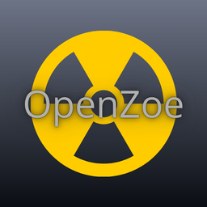

# ☢️ OpenZoe Docker


[](https://github.com/gabrielamaroufrj/OpenZoe/releases)

[](https://github.com/gabrielamaroufrj/OpenZoe/blob/aea56ca446c7c20a798d3ce674d2186c6f629420/docs/PIX.md)

> **Sistema de Gerenciamento e Análise de Doses em Radiologia (DICOM SR)**

O **OpenZoe** é uma aplicação desktop desenvolvida para auxiliar Físicos Médicos e profissionais de radiologia no monitoramento de doses de radiação. O sistema processa arquivos **DICOM SR (Structured Report)**, centraliza os dados em um banco local e oferece ferramentas visuais para análise de indicadores de qualidade e segurança do paciente. Esta versão foi alterada para rodar diretamente em servidores linux via container docker.

---

## 📋 Funcionalidades Principais

### 1. 📂 Processamento DICOM SR
* **Extração Automática:** Leitura em lote de arquivos DICOM para extração de metadados essenciais:
  * Dose acumulada (mGy)
  * DAP (Gy·m²)
  * Tempo de fluoroscopia/aquisição
  * Médico responsável
  * ID e Sexo do Paciente
  * Sala e Tipo de Exame

### 2. 🚨 Monitoramento e Alertas de Dose
Visualização intuitiva na tabela de dados com **código de cores** para níveis de alerta de dose:
* 🟣 **1000 - 1999 mGy:** Alerta Roxo
* 🔵 **2000 - 2999 mGy:** Alerta Azul
* 🟡 **3000 - 3999 mGy:** Alerta Amarelo
* 🟠 **4000 - 4999 mGy:** Alerta Laranja
* 🔴 **≥ 5000 mGy:** Alerta Vermelho (Nível Crítico)

### 3. 📊 Dashboards Interativos
Visualização gráfica para tomada de decisão rápida:
* **Evolução Temporal:** Quantidade de exames realizados por dia.
* **Performance Médica:** Comparativo de média de dose e tempo por profissional.
* **Análise por Procedimento:** Média de dose e tempo por tipo de exame.
* **Linhas de Referência:** Indicadores visuais nos gráficos para limites de controle (ex: 1000 mGy).
* **Exportação:** Salve os gráficos gerados como imagem (PNG) de alta resolução.
* 
### 4. ⚙️ Gestão e Configuração
* **Banco de Dados Local (SQLite):** Armazenamento seguro sem necessidade de servidores complexos.
* **CRUD Completo:** Adicione, edite ou remova registros manualmente se necessário.
* **Tipos de Exames Personalizáveis:** Adicione ou remova categorias de exames (ex: CAT, NEURO, VASC) através do menu de configurações.

---

## 🛠️ Tecnologias Utilizadas

O projeto foi desenvolvido inteiramente em **Python**, utilizando as seguintes bibliotecas:

* **[Flet](https://flet.dev/):** Interface gráfica (UI) moderna e responsiva.
* **[Pydicom](https://pydicom.github.io/):** Leitura e manipulação de arquivos DICOM.
* **[Matplotlib](https://matplotlib.org/):** Geração e exportação de gráficos estáticos.
* **[Flet Charts](https://github.com/flet-dev/flet-charts):** Gráficos interativos nativos.
* **SQLite3:** Banco de dados relacional leve.
* **FPDF:** Gerador de PDFs

---

## 🏥 Instalação em Servidores (Versão Docker)

Esta versão foi arquitetada para rodar de forma contínua (24/7) em servidores hospitalares, NAS ou máquinas Linux dedicadas. A utilização do Docker garante isolamento das dependências, estabilidade e atualização simplificada.

### Pré-requisitos
* Servidor Linux (Ubuntu, Debian, ZimaOS, TrueNAS, etc.).
* [Docker](https://docs.docker.com/get-docker/) e [Docker Compose](https://docs.docker.com/compose/install/) instalados no servidor.

### Passo a Passo de Instalação

**1. Posicione os arquivos no servidor**
Clone este repositório ou transfira os arquivos do projeto para uma pasta no armazenamento principal do seu servidor (exemplo: `/DATA/openzoe` ou `/opt/openzoe`).

**2. Entenda a persistência de dados**
O arquivo `docker-compose.yml` já está pré-configurado para criar um volume seguro. O sistema gerará automaticamente uma pasta local chamada `data/`, onde seu banco de dados SQLite (`openzoe.db`) e o diretório de entrada DICOM ficarão salvos. **Seus dados não serão perdidos se o container for atualizado ou reiniciado.**

**3. Construa e inicie o container**
Abra o terminal do servidor via SSH, navegue até a pasta onde os arquivos estão localizados e execute o comando abaixo para construir a imagem e rodar o serviço em segundo plano:

```bash
sudo docker compose up -d --build
