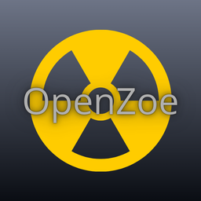

# ☢️ OpenZoe


[](https://github.com/gabrielamaroufrj/OpenZoe/releases)

[](https://github.com/gabrielamaroufrj/OpenZoe/blob/aea56ca446c7c20a798d3ce674d2186c6f629420/docs/PIX.md)

> **Sistema de Gerenciamento e Análise de Doses em Radiologia (DICOM SR)**

O **OpenZoe** é uma aplicação desktop desenvolvida para auxiliar Físicos Médicos e profissionais de radiologia no monitoramento de doses de radiação. O sistema processa arquivos **DICOM SR (Structured Report)**, centraliza os dados em um banco local e oferece ferramentas visuais para análise de indicadores de qualidade e segurança do paciente.

---

## 📋 Funcionalidades Principais

### 1. 📂 Processamento DICOM SR
* **Extração Automática:** Leitura em lote de arquivos DICOM para extração de metadados essenciais:
  * Dose acumulada (mGy)
  * DAP (Gy·m²)
  * Tempo de fluoroscopia/aquisição
  * Médico responsável
  * ID e Sexo do Paciente
  * Sala e Tipo de Exame

### 2. 🚨 Monitoramento e Alertas de Dose
Visualização intuitiva na tabela de dados com **código de cores** para níveis de alerta de dose:
* 🟣 **1000 - 1999 mGy:** Alerta Roxo
* 🔵 **2000 - 2999 mGy:** Alerta Azul
* 🟡 **3000 - 3999 mGy:** Alerta Amarelo
* 🟠 **4000 - 4999 mGy:** Alerta Laranja
* 🔴 **≥ 5000 mGy:** Alerta Vermelho (Nível Crítico)


### 3. 📊 Dashboards Interativos
Visualização gráfica para tomada de decisão rápida:
* **Evolução Temporal:** Quantidade de exames realizados por dia.
* **Performance Médica:** Comparativo de média de dose e tempo por profissional.
* **Análise por Procedimento:** Média de dose e tempo por tipo de exame.
* **Linhas de Referência:** Indicadores visuais nos gráficos para limites de controle (ex: 1000 mGy).
* **Exportação:** Salve os gráficos gerados como imagem (PNG) de alta resolução.

### 4. ⚙️ Gestão e Configuração
* **Banco de Dados Local (SQLite):** Armazenamento seguro sem necessidade de servidores complexos.
* **CRUD Completo:** Adicione, edite ou remova registros manualmente se necessário.
* **Tipos de Exames Personalizáveis:** Adicione ou remova categorias de exames (ex: CAT, NEURO, VASC) através do menu de configurações.

---

## 🛠️ Tecnologias Utilizadas

O projeto foi desenvolvido inteiramente em **Python**, utilizando as seguintes bibliotecas:

* **[Flet](https://flet.dev/):** Interface gráfica (UI) moderna e responsiva.
* **[Pydicom](https://pydicom.github.io/):** Leitura e manipulação de arquivos DICOM.
* **[Matplotlib](https://matplotlib.org/):** Geração e exportação de gráficos estáticos.
* **[Flet Charts](https://github.com/flet-dev/flet-charts):** Gráficos interativos nativos.
* **SQLite3:** Banco de dados relacional leve.
* **FPDF:** Gerador de PDFs

---

## 🚀 Como Rodar o Projeto

### Pré-requisitos
* Python 3.10 ou superior instalado.

### Passo a Passo

1. **Crie uma venv (Recomendado):**
   ```bash
   python -m venv .venv  
   source .venv/bin/activate

2. **Instale as bibliotecas:**
   ```bash
   pip install 'flet[all]'
   pip install flet_charts
   pip install matplotlib
   pip install pydicom
   pip install fpdf2

3. **Clone o repositório:**
   ```bash
   git clone https://github.com/gabrielamaroufrj/OpenZoe.git
   cd OpenZoe

4. **Rode o main.py:**
   ```bash
   python main.py
   
## 🚀 Agradeciementos:

  Esse projeto não seria possível sem a ajuda dos Físicos Médicos do Hospital Universitário Antônio Pedro - HUAP - UFF - EBSERH:
  Diego Mendes dos Santos - https://www.linkedin.com/in/diegostd/?utm_source=share&utm_campaign=share_via&utm_content=profile&utm_medium=ios_app
  Ryenne Bañolas Bueno - https://www.linkedin.com/in/ryenne-ba%C3%B1olas-bueno-283095a3/?utm_source=share_via&utm_content=profile&utm_medium=member_ios

## 🩷 Apoie o projeto:
[](https://github.com/gabrielamaroufrj/OpenZoe/blob/aea56ca446c7c20a798d3ce674d2186c6f629420/docs/PIX.md)
